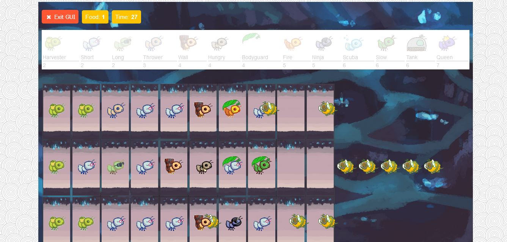

# Ants

This is a video game similar to Plants vs Zombies which I built as a part of CS61A's curriculum. The implementation of all the different types of ants relied heavily on the knowledge of Inheritance.
The starter files were provided and I only had to make changes in the ants.py file. The game's user interface is provided as a part of the starter files in the ants_gui.py file.

## Demo



## How to Play

python gui.py
```
Running this in terminal begins the game.

